## Resources

- [SIM7000 FlashTools](https://drive.google.com/file/d/1nOqJuzBgE8KrMkpQUAWy3nJwqEBVABVn/view?usp=sharing)
- [SIM7000 Driver](https://drive.google.com/file/d/1f02TTNoyirFPGWbob1khy9dnoBonoVe7/view?usp=sharing)
- [1529B11V01SIM7000G Fixed MQTTS,HTTPS](https://drive.google.com/file/d/12rZ9b7z3ONCPwtevOcz3khYl5vw4zGL3/view?usp=sharing)

## Quick Step

1. To solder the USB to the upgrade solder joint, you can choose a flying lead or directly solder the USB to the contact.
2. Power on the SIM7000G board, and at the same time connect the USB interface to the computer port (please note that you need to insert the SIM card during the upgrade process)
    
    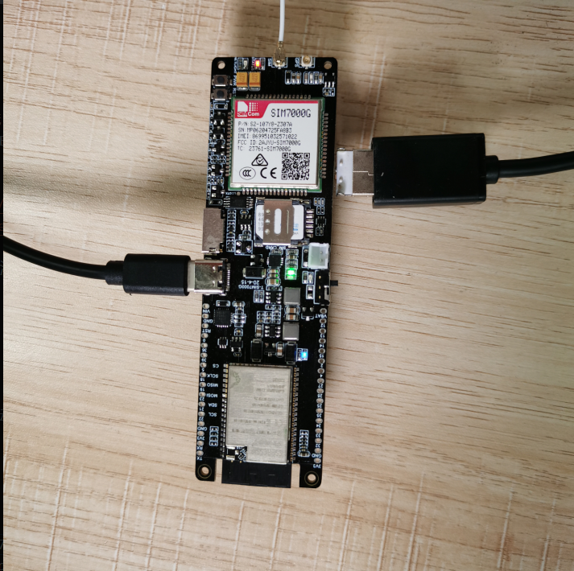
3. Download [SIM7000X Driver](https://1drv.ms/u/s!AmbpOqVezk5drS-ateuVXXDK1ulv?e=yc0kXz), and decompress the corresponding compressed package according to the system you are using.
4. Open the computer device manager and follow the steps below to add the driver.
    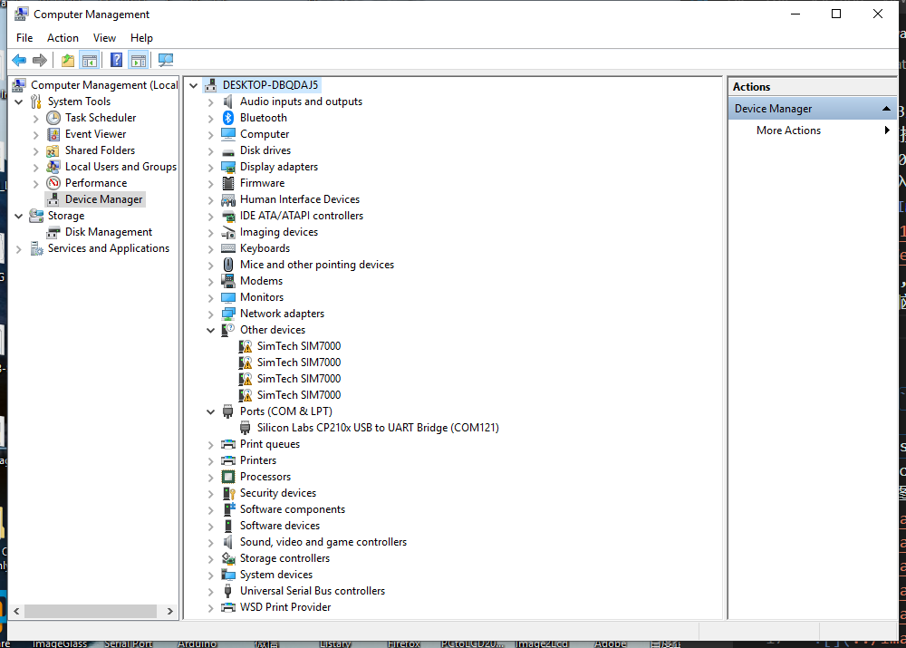
    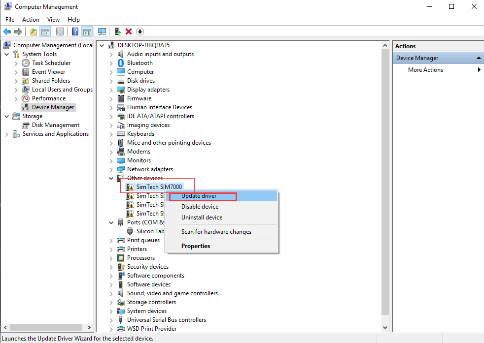
    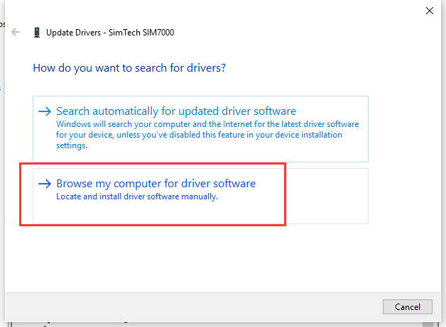
    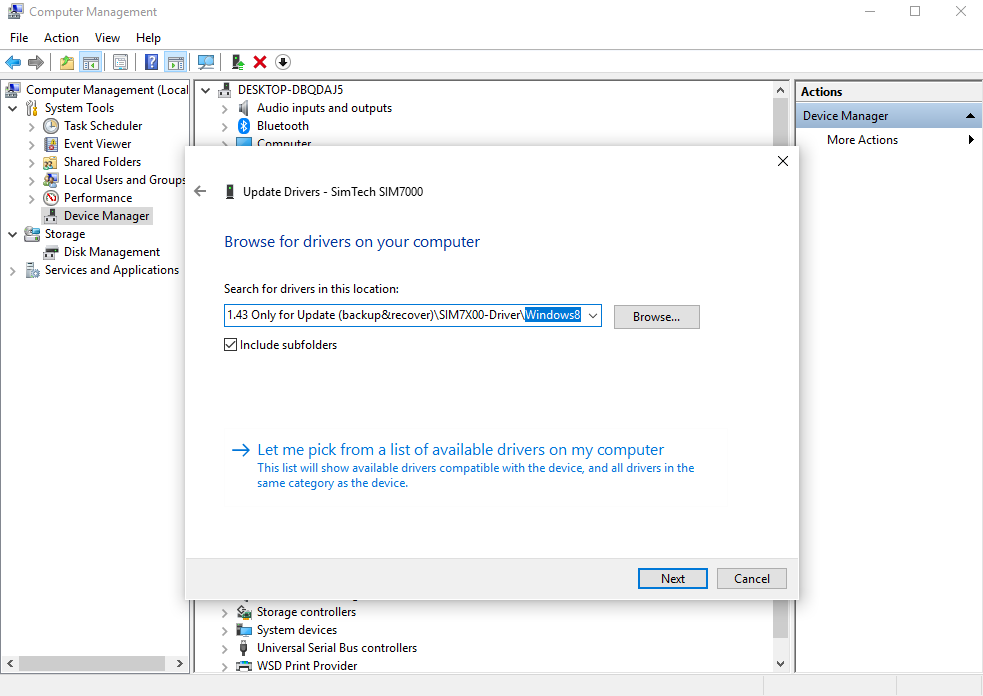
    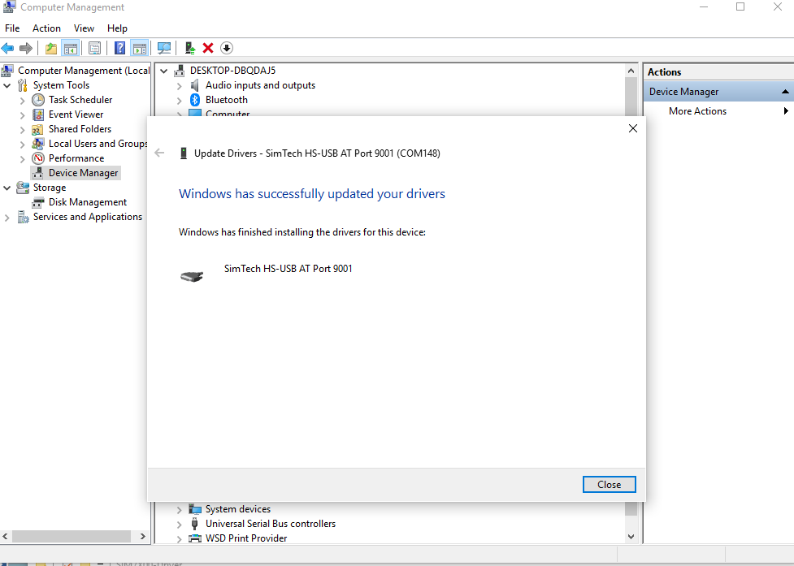
    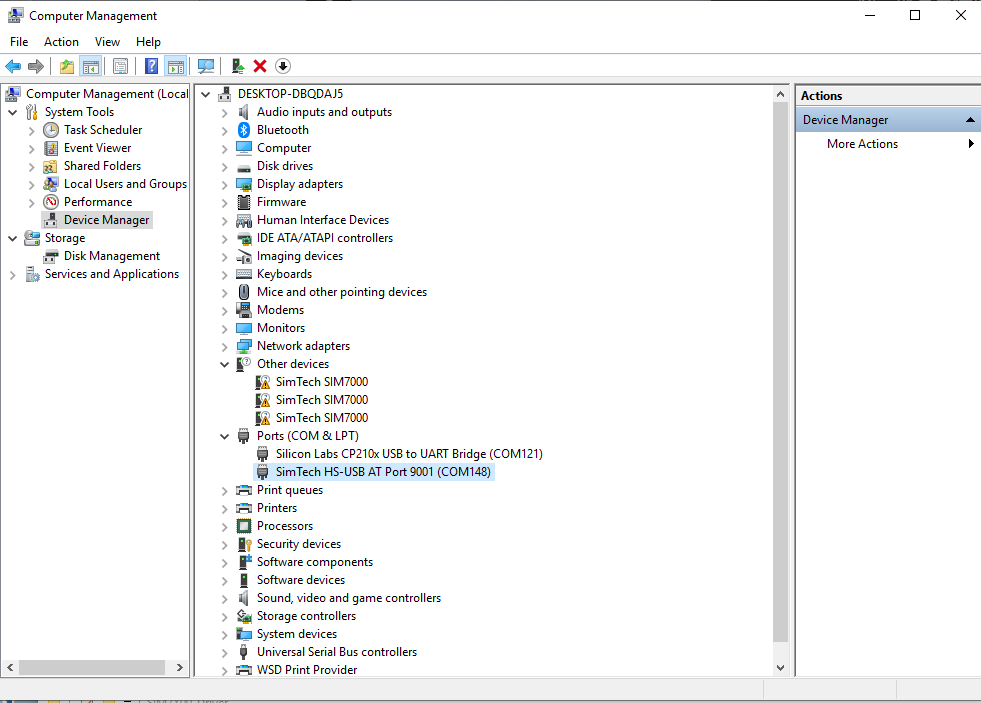
    Follow the above steps to install the driver for the remaining ports that are not installed.
    

5. Unzip `SIM7000-Update-tools.7z`
6. Open `setup.exe` , install update tools
7. Follow the steps below to install
    
    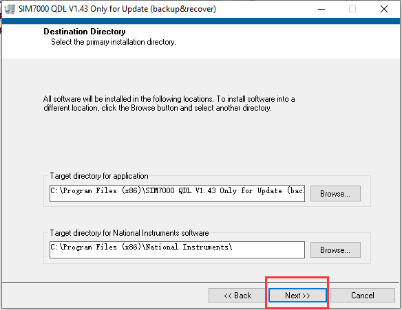
    
    
    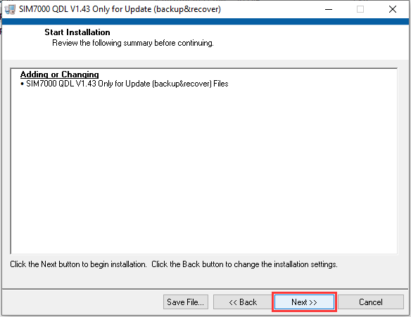
    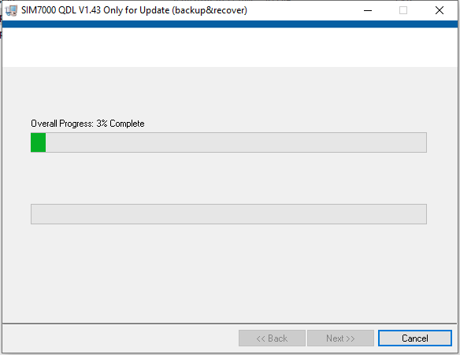
    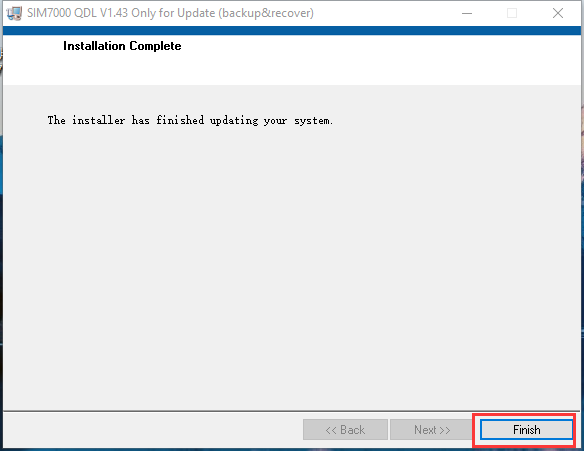
    

8. Open the upgrade tool and follow the diagram below

    
    
    
    
    
    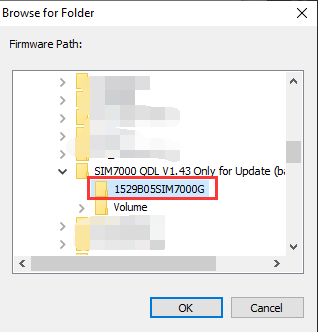
    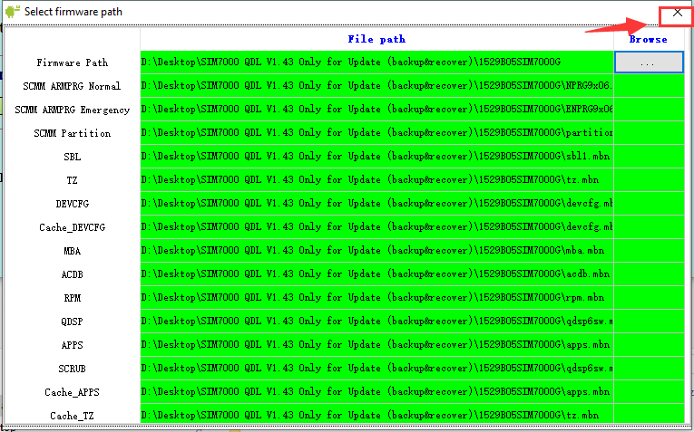
    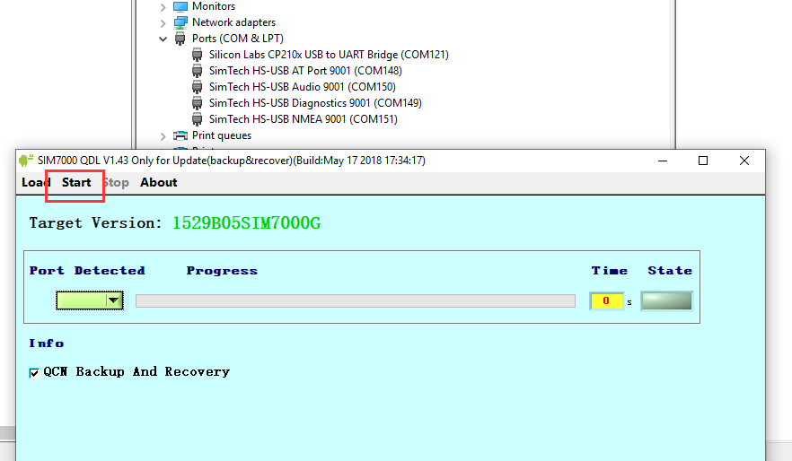
    
    Note that when the following figure is executed, it will prompt that the new port has no driver installed. After adding the driver according to the above steps to install the driver, click Start again to update.
    

    When prompted `Update Success!`, click Stop to stop the update. At this point, the firmware update has been completed.

    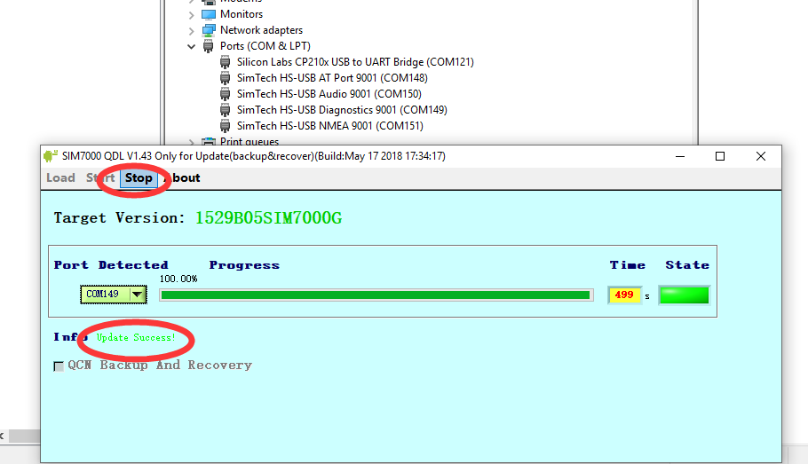

9. Open the serial terminal tool, or the built-in serial tool of `Arduino IDE`, select `AT Port` for the port, and enter `AT+CGMR` to view the firmware version
    

  
## Note

If you need to update the 7070G internal firmware, please select the model below to update

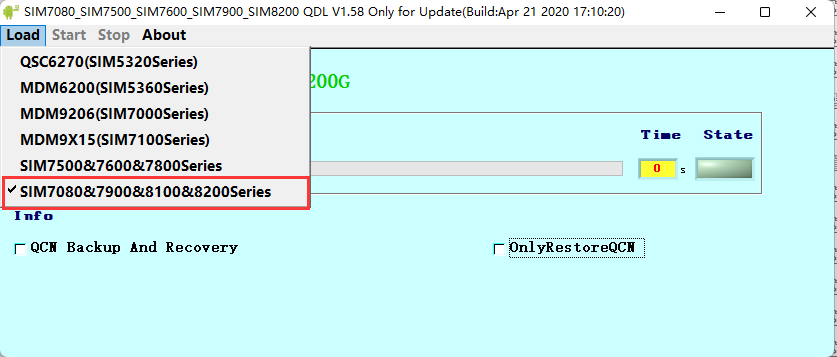

Note: the modem must be kept powered on during the procedure; upload an appropriate sketch such as `ATdebug`
